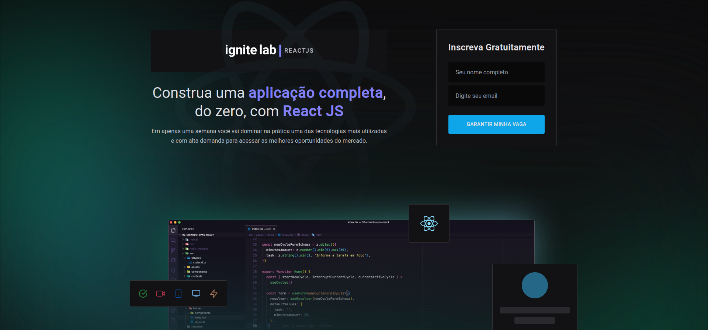
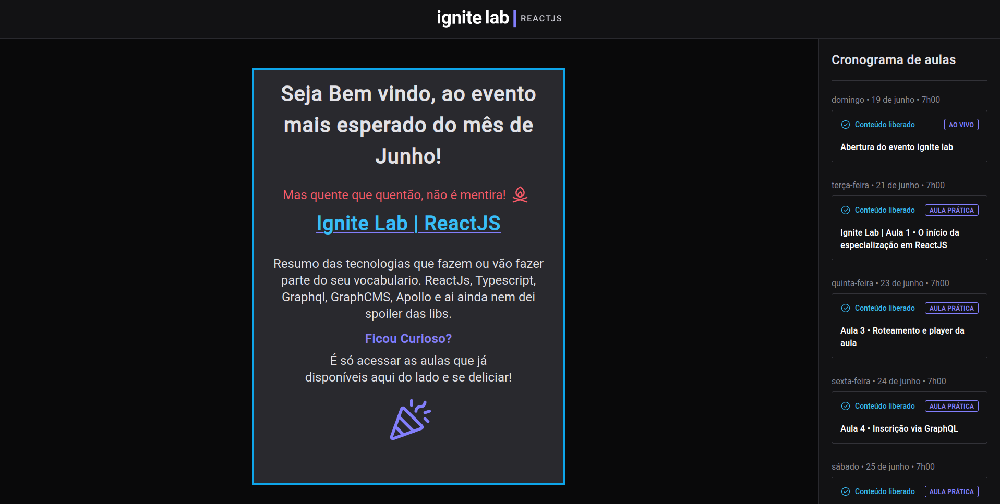
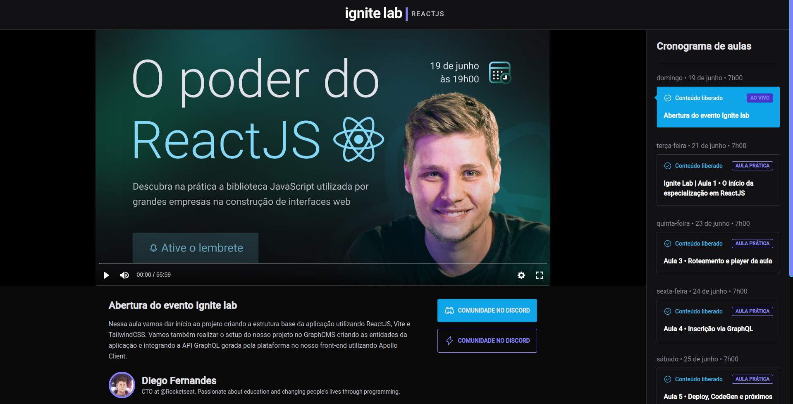

#
<p align="center">
    
    
</p>


<p align="center">
  <a href="#rocket-tecnologias">Tecnologias</a>&nbsp;&nbsp;&nbsp;|&nbsp;&nbsp;&nbsp;
  <a href="#-projeto">Projeto</a>&nbsp;&nbsp;&nbsp;|&nbsp;&nbsp;&nbsp;
  <a href="#-layout">Layout</a>&nbsp;&nbsp;&nbsp;|&nbsp;&nbsp;&nbsp;
</p>
<br>

<p align="center">
    
</p>

<br>
<p align="center">
    
</p>
<br>

---
## 🚀 Tecnologias

Esse projeto foi desenvolvido utilizando as seguintes tecnologias:

- [React](https://pt-br.reactjs.org/)
- [Vite](https://vitejs.dev/)
- [TypeScript](https://www.typescriptlang.org/)
- [Tailwind](https://tailwindcss.com/)
- [GraphQL](https://graphql.org/)
- [GraphCMS](https://graphcms.com/)
- [GraphQL Generate Code](https://www.graphql-code-generator.com/)
- [Apollo](https://www.apollographql.com/)
- [Phosphor](https://phosphoricons.com/)
<br>

---

## 📋  Requisitos ##

Antes de iniciar você precisa :checkered_flag:, ter instalado o [Git](https://git-scm.com) e [Node](https://nodejs.org/en/).

<br>

---
## ⌨ Como executar o projeto ##

```bash
# Clone this project
$ git clone git@github.com:Ca-byte/event_platform_ignite_lab.git

# Access
$ cd event-platform

# Install dependencies
$ npm i

# Run the project
$ npm run dev

# The server will initialize in the <http://localhost:3000>
```
<br>

---

## 💻 Projeto

Nesse semana do ignite lab nós aprendemos tecnologias avançadas e altamente performaticas.
Uma plataforma de conteúdos em vídeo, para ser mais exata a mesma plataforma que utilizamos para aprender esse conteúdo, incrível não é mesmo? :star_struck:
(https://event-platform-ignite-lab-kappa.vercel.app/) 

Este é um projeto desenvolvido durante a **[Ignite Lab](https://lp.rocketseat.com.br/inscricao/ignite-lab/)**, realizada pela **[@Rocketseat](https://github.com/Rocketseat)** durante os dias 20 a 26 de junho 2022.

<br>

---

## 🔖 Layout

Você pode visualizar o layout do projeto através dos links abaixo:
Eu fiz a minha versão de cores e de responsividade. Fique a vontade para duplicar e abusar da criatividade.

- [Ignite Lab](https://www.figma.com/file/YvOPZLgvtf2yGR1eYu57T6/Plataforma-de-evento---Ignite-Lab-by-Carol?node-id=35%3A183)

Lembrando que você precisa ter uma conta no [Figma](http://figma.com/) para acessá-lo.


---


<br>
<p align="center">Desenvolvido com 💜 por Caroline Vieira</p>
